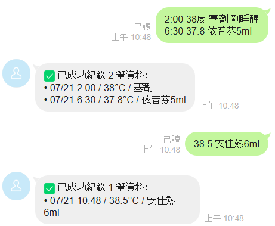
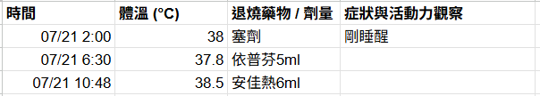
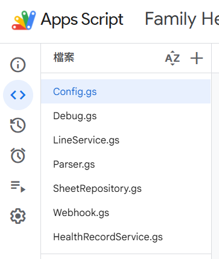
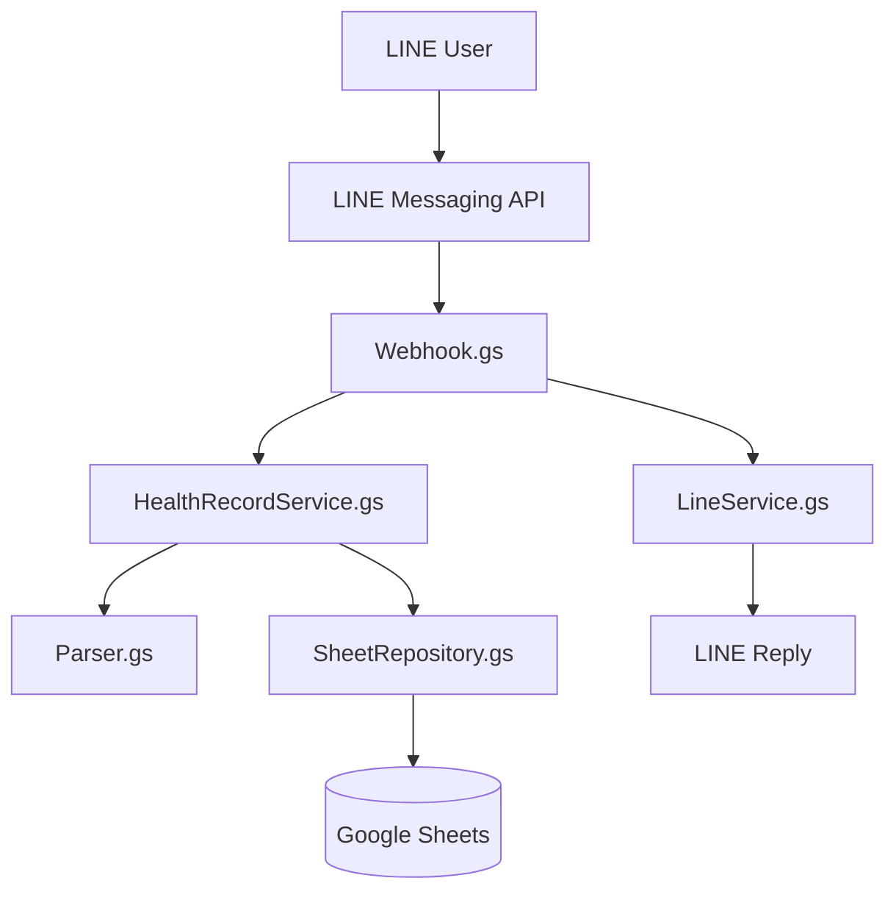

# Family Healthcare Automation

A lightweight healthcare record automation system built with **Google Apps Script**, **LINE Messaging API**, and **Google Sheets**.

Users can simply send health records through LINE, and the system automatically parses the message, stores structured data into Google Sheets, and replies with a confirmation message.


---

# 📱 Demo

## LINE Bot

Users can send one or multiple health records in a single message.



---

## Google Sheets

Every valid record is automatically stored in Google Sheets.



---

## Google Apps Script Project

Project source code is organized into independent layers for maintainability.



---

# 🚀 Highlights

- Layered Architecture (Webhook → Service → Repository)
- LINE Messaging API integration
- Google Apps Script Web App
- Automatic health record parsing
- Multi-line message support
- Repository Pattern
- Script Properties for secure credential management
- Google Sheets integration
- Integration testing
- Lightweight serverless architecture

---

# 📖 Overview

Family Healthcare Automation was created to simplify daily healthcare record management for families.

Instead of manually writing down temperatures, medications, and observations, users simply send a LINE message such as:

```text
2:00 38°C 塞劑 剛睡醒
6:30 37.8 依普芬5ml
```

The system automatically:

- Parses each record
- Extracts temperature
- Extracts medication
- Extracts observations
- Stores structured data
- Replies with a confirmation message

The project is completely serverless and runs on Google Apps Script.

---

# ✨ Features

## Health Record Parsing

Supports:

- Temperature
- Medication
- Dosage
- Observation
- Time
- Multiple records

Example:

```text
2:00 38°C 塞劑 剛睡醒
6:30 37.8 依普芬5ml
```

↓

```text
Record 1
Time: 2:00
Temperature: 38
Medicine: 塞劑
Observation: 剛睡醒

Record 2
Time: 6:30
Temperature: 37.8
Medicine: 依普芬5ml
```

---

## LINE Bot

- Receive messages
- Parse records
- Save to Google Sheets
- Reply automatically

---

## Google Sheets

Automatically appends new rows.

Example:

| Time | Temperature | Medicine | Observation |
|------|-------------|-----------|-------------|
|07/21 02:00|38|塞劑|剛睡醒|
|07/21 06:30|37.8|依普芬5ml||

---

# 🏗 Architecture



---

## Project Structure

```text
family-healthcare-automation/
│
├── src/
│   ├── Config.gs
│   ├── Webhook.gs
│   ├── LineService.gs
│   ├── HealthRecordService.gs
│   ├── Parser.gs
│   └── SheetRepository.gs
│
├── tests/
│   └── Debug.gs
│
├── images/
│   ├── line-demo.png
│   ├── google-sheet.png
│   └── apps-script.png
│
├── README.md
├── LICENSE
└── .gitignore
```

---

# 🏛 Layered Design

```
Presentation Layer
│
├── Webhook.gs
└── LineService.gs

Business Layer
│
└── HealthRecordService.gs

Parsing Layer
│
└── Parser.gs

Data Layer
│
└── SheetRepository.gs

Configuration
│
└── Config.gs
```

Each layer has a single responsibility, making the project easier to maintain and test.

---

# ⚙ Installation

## 1. Clone Repository

```bash
git clone https://github.com/<your-account>/family-healthcare-automation.git
```

---

## 2. Open Google Apps Script

Create a new Google Apps Script project.

Copy all `.gs` files from the `src/` directory into your Apps Script project.

If you want to run the provided test utilities, also copy the files under the `tests/` directory.

---

## 3. Configure Script Properties

Create the following Script Property:

| Key | Value |
|------|------|
|LINE_ACCESS_TOKEN|Your LINE Messaging API Channel Access Token|

---

## 4. Deploy Web App

Deploy as:

```
Execute as:
Me

Who has access:
Anyone
```

---

## 5. Configure LINE Webhook

Paste the deployed Web App URL into the LINE Messaging API Webhook URL.

Enable:

- Webhook
- Use Webhook

Disable:

- Auto Reply

---

# 🧪 Testing

The project includes unit and integration tests, runnable directly from the Apps Script editor:

| Function | Type | Verifies |
|----------|------|----------|
|`testParseHealthRecord()`|Unit|Parser output for known inputs (temperature, medicine, observation-only, noise)|
|`testParser()`|Unit|`parseHealthRecord()` against a range of sample messages|
|`integrationTest()`|Integration|`saveHealthRecords()` end-to-end against a mock repository, across 6 scenarios|
|`integrationTestLeave()`|Integration|`handleLeave()` group-leave behavior|
|`webhookTest()`|Integration|`doPost()` with a mock LINE webhook payload|
|`debugTest()`|Integration|Full webhook flow with a multi-line health record message|

To simulate a full LINE webhook request end-to-end, run:

```javascript
debugTest();
```

The test will:

- Create a mock LINE webhook event
- Execute the webhook handler
- Parse health records
- Save records into Google Sheets
- Verify the end-to-end workflow

---

# 💡 Design Decisions

| Decision | Reason |
|----------|--------|
|Layered Architecture|Separate responsibilities|
|Repository Pattern|Decouple storage from business logic|
|Script Properties|Protect API credentials|
|Google Sheets|Simple cloud storage|
|Google Apps Script|Serverless deployment|
|LINE Bot|Easy access for family members|

---

# 🔐 Security

The repository does **NOT** contain:

- LINE Channel Access Token
- Personal health records
- Environment variables

Sensitive data is stored in:

Google Apps Script → Script Properties

---

# 🛣 Roadmap

Future improvements:

- [ ] Family member management
- [ ] Reminder notifications
- [ ] Medication history
- [ ] Export CSV
- [ ] Dashboard
- [ ] Data visualization
- [ ] AI symptom analysis
- [ ] Email reports

---

# 🛠 Technologies

| Category | Technology |
|-----------|------------|
|Language|JavaScript (ES6)|
|Platform|Google Apps Script|
|Messaging|LINE Messaging API|
|Storage|Google Sheets|
|Version Control|Git|
|Repository|GitHub|

---

# 📚 What I Learned

Through this project, I practiced:

- REST API integration
- Google Apps Script development
- LINE Messaging API
- Layered architecture
- Repository pattern
- Regular expression parsing
- Integration testing
- Git version control
- Secure configuration management

---

# 👩‍💻 Author

**Olive Peng**

Software Engineer

Interested in:

- Test Automation
- SDET
- CI/CD
- Android Development
- Software Quality

[GitHub](https://github.com/<your-username>) · [LinkedIn](https://linkedin.com/in/<your-profile>) · [Email](mailto:<your-email>)

---

# 📄 License

This project is licensed under the MIT License.